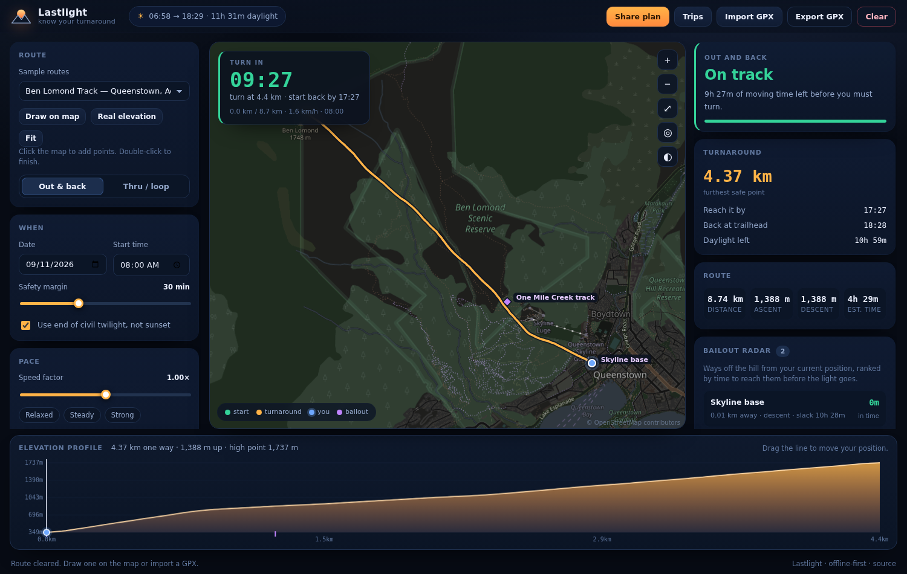
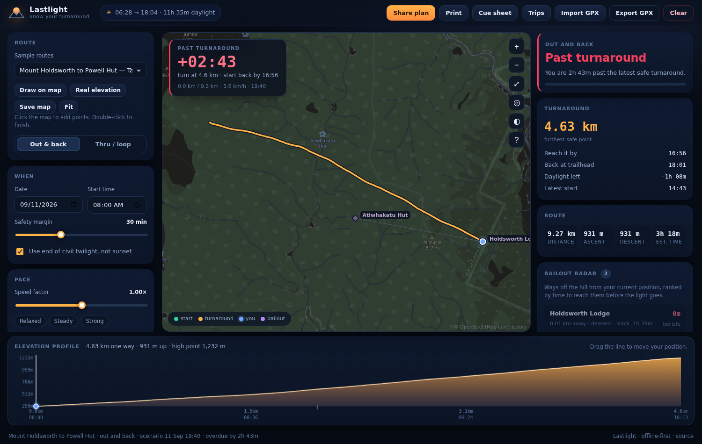
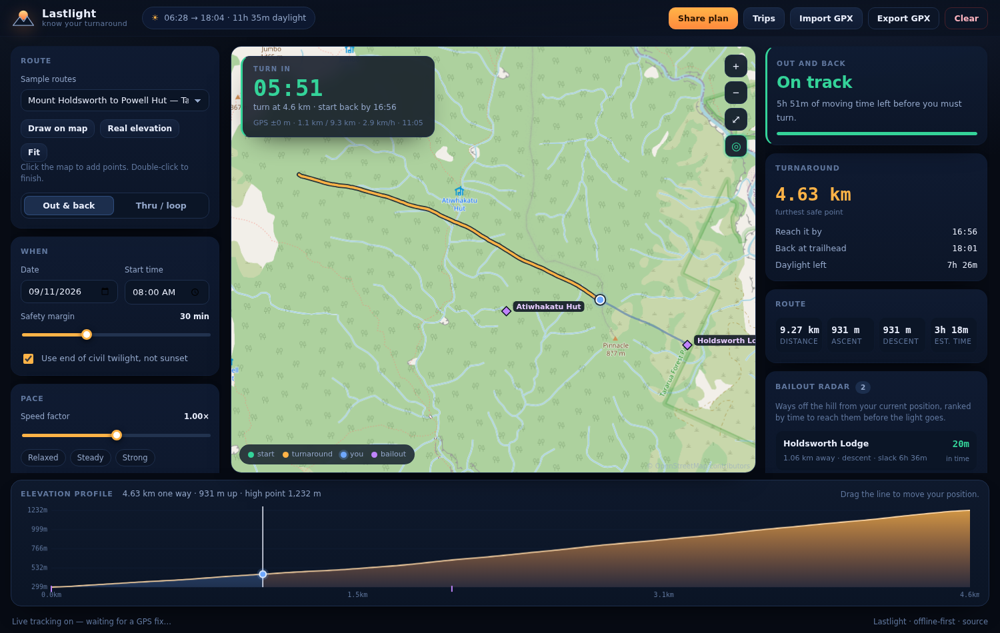
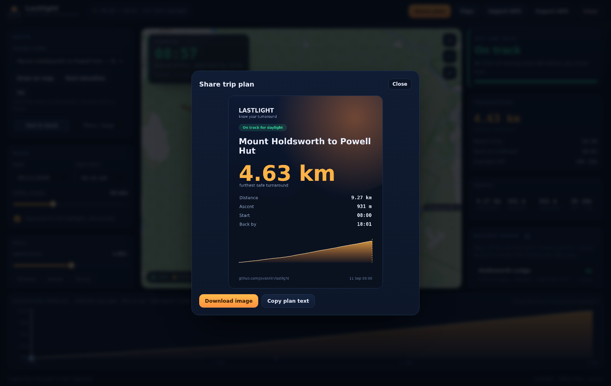
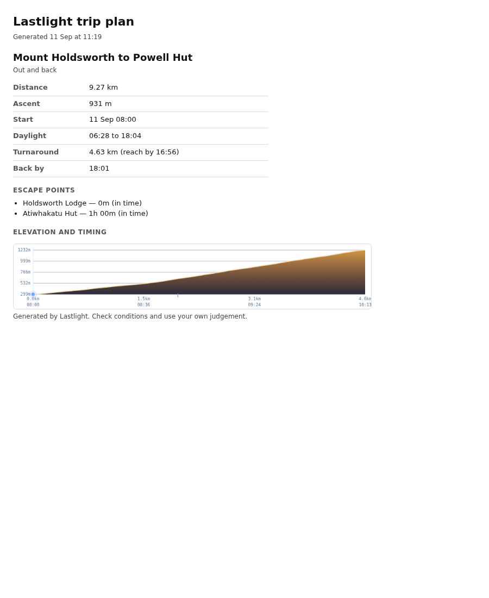

# Lastlight

**Know your turnaround before the mountain decides for you.**

Lastlight is an offline-first hiking companion built around a single question that
every other trail app answers badly: *given where I am right now, how much further
can I safely go and still get back before dark?*

Existing apps show you a line on a map. Lastlight runs a live **turnaround clock**
that folds together the terrain still ahead, your actual pace, the daylight left,
your safety margin, and the nearest way out.



---

## The idea

Most incidents on day hikes are not navigational. They are timing failures: a late
start, a slower-than-planned climb, a wrong turn, a sunset that arrives sooner than
the summit did. Turnaround time is taught in every hiking book and practised by
almost nobody, because working it out mid-hike is hard.

Lastlight makes it a number you can glance at.

## What it does

- **Live turnaround clock** - the latest time you may keep going, recomputed from
  your real position and pace, not a static plan.
- **Go / caution / turn verdict** - one glanceable state for the current moment.
- **Bailout radar** - nearby fire roads, huts and trailheads, ranked by whether you
  can actually reach them before the light goes, including off-trail detours.
- **Terrain-aware pacing** - Tobler’s hiking function blended with a moving ratio,
  so a 20% grade costs what it should.
- **Real daylight** - sunrise, sunset and civil/nautical/astronomical twilight
  computed on-device for your exact latitude and longitude. No API, no network.
- **Group pace** - plan for the slowest member, so nobody gets left on the ridge.
- **Pace calibration** - enter how long a hike actually took and the app refits
  your speed factor to match it.
- **Latest start** - the last time you can leave the trailhead and still be back
  before dark, plus a headlamp warning when the plan runs into twilight.
- **Live GPS** - watch the clock update from your real position, with fix
  accuracy and off-route distance.
- **Conditions** - an optional Open-Meteo forecast for the hike window.
- **Shareable safety card** - a PNG and a text plan to send to someone staying home.
- **Offline maps** - save the tiles around a route before you lose signal.
- **Print a plan** - a clean sheet with the turnaround, timings and escape
  points to leave with someone at home.
- **Offline first** - a service worker and local storage keep it working with no
  signal, because that is exactly where it matters.

## How it works

The safety-critical maths lives in small, dependency-free, unit-tested modules
under `src/core/`. The UI is plain ES modules, so there is no build step and no
supply chain to trust on a mountain.

- [docs/CONCEPTS.md](docs/CONCEPTS.md) - the turnaround clock, pacing, twilight
  and bailout reasoning, and the constants you might want to argue with.
- [docs/ARCHITECTURE.md](docs/ARCHITECTURE.md) - module map, data flow, offline
  strategy and testing.

## Develop

```sh
npm test      # 54 unit tests, no dependencies
npm start     # dev server on http://localhost:5173 with live reload
```

The app is deployed to GitHub Pages from the \`main\` branch root. See
[docs/CI.md](docs/CI.md) to enable the optional CI and Pages workflows.

Requires Node 20 or newer. There are no runtime dependencies.

## Keyboard shortcuts

| Key | Action |
| --- | --- |
| `Space` | Run or pause the simulated hike |
| `Left` / `Right` | Move the position 100 m along the route |
| `D` | Toggle route drawing |
| `T` | Open the trip library |
| `S` | Share the trip plan |
| `L` | Toggle live GPS |
| `F` | Fit the route on the map |
| `?` | List the shortcuts |

## Roadmap

- [x] Core geodesy, pacing, solar and turnaround engines with tests
- [x] Canvas map engine, route drawing, GPX import/export, night map style
- [x] Elevation profile with live position scrubbing
- [x] Live turnaround HUD, verdicts and the "behind schedule" stress test
- [x] Bailout radar on the map
- [x] Offline PWA shell (service worker, tile caching)
- [x] Local trip store and session restore (IndexedDB)
- [x] Weather window and elevation lookups
- [x] Group mode: pace to the slowest member
- [x] Shareable safety check-in card
- [x] Live GPS tracking with route snapping
- [x] Latest-start and headlamp-darkness planning
- [x] Personal pace calibration from recorded hikes
- [x] Offline map saving for the route area
- [x] Printable trip plan
- [x] Accessibility pass (labels, live region, focus management)
- [ ] Multi-day and overnight planning
- [ ] Turn-by-turn cue sheet export

## Screens

| Turnaround alarm | Live GPS | Share card | Print plan |
| --- | --- | --- | --- |
|  |  |  |  |

## License

MIT © Jovan Xin
